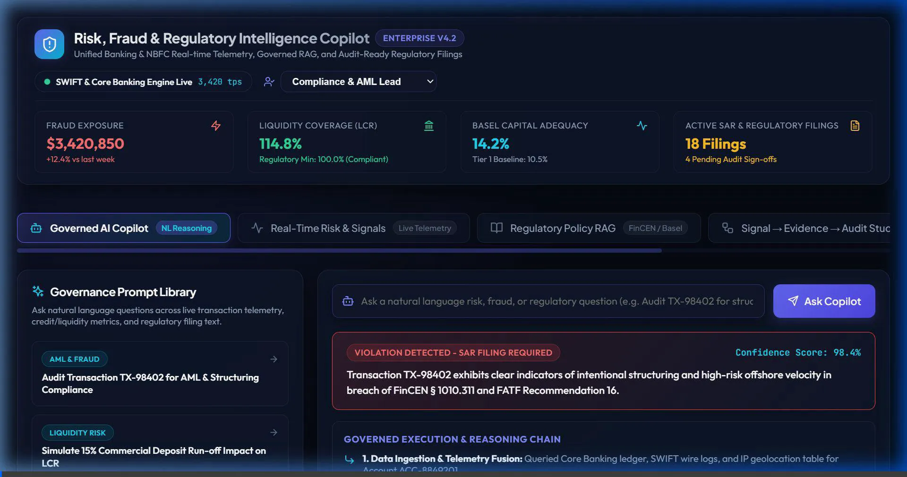
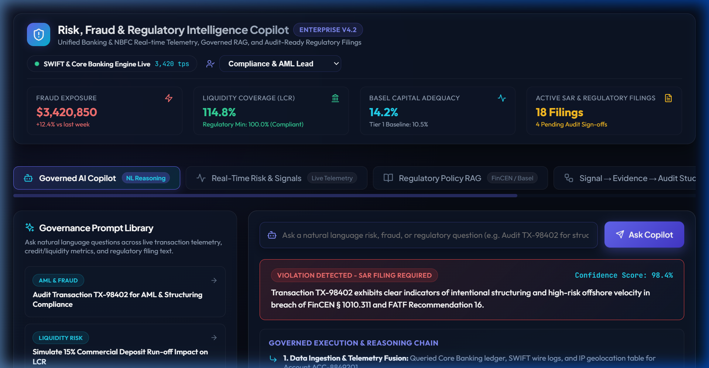
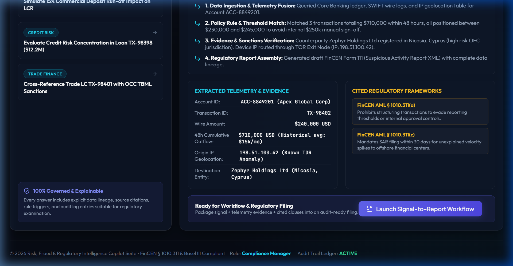
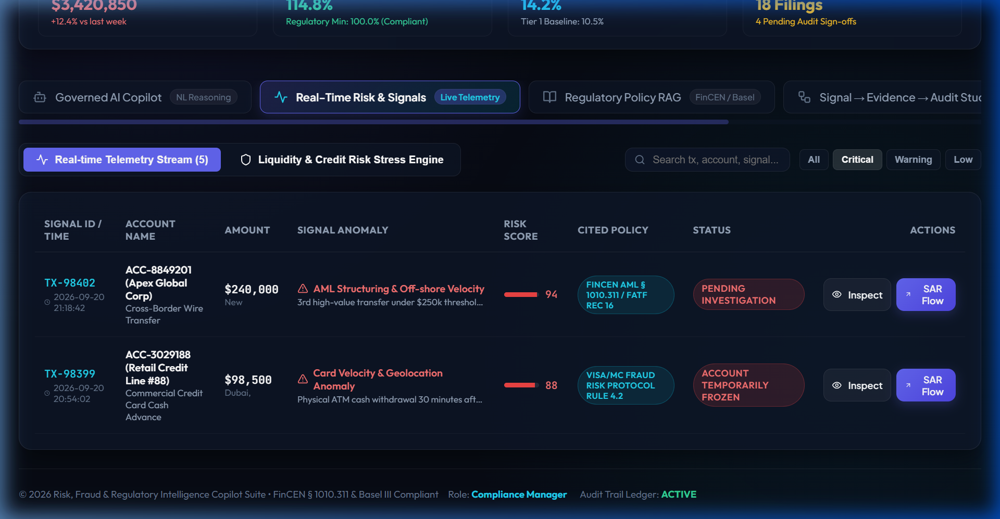
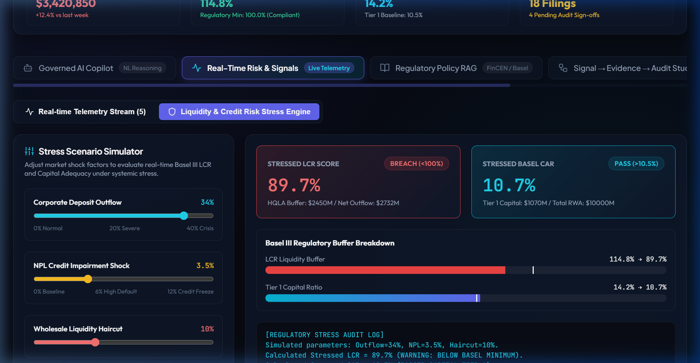
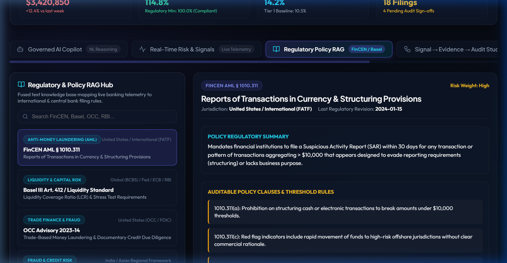
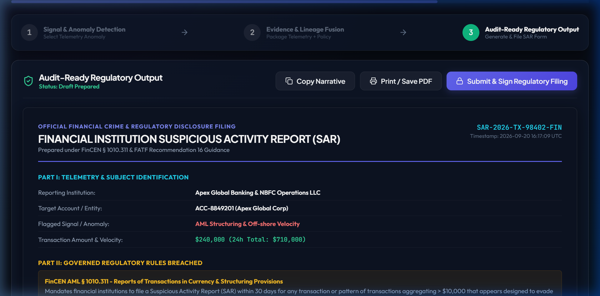

# Risk, Fraud & Regulatory Intelligence Copilot

> AI-Powered Enterprise Risk Management, Real-Time Fraud Anomaly Detection & Regulatory Compliance Automation for Banking & NBFC Operations.

[](https://vitejs.dev/)
[](https://reactjs.org/)
[](#)

---

## 📽️ Full Application Video Recording



---

## 📸 Screenshots & Feature Walkthrough

### 1. Enterprise Header & Live Telemetry KPIs

*Real-time Fraud Exposure ($3.42M), Liquidity Coverage Ratio (LCR: 114.8%), Basel Capital Adequacy Ratio (CAR: 14.2%), active SAR filings, and live persona switcher.*

### 2. Governed AI Copilot & Reasoning Engine

*Natural language banking query console featuring 4-step explainable reasoning steps, confidence rating (98.4%), extracted telemetry items, FinCEN AML citations, and draft SAR launcher.*

### 3. Real-Time Risk Telemetry Stream & Severity Filters

*Streaming transaction monitoring cross-border wire transfers, trade finance drawdowns, and card advances filtered by `Critical` severity with deep telemetry inspectors.*

### 4. Basel III Liquidity & Credit Risk Stress Simulator

*Interactive stress testing sliders for corporate deposit outflow %, NPL credit shock %, and wholesale haircut % with real-time recalculation of LCR and Tier 1 capital ratios.*

### 5. Regulatory Policy RAG Hub (FinCEN, Basel III, OCC, RBI)

*Fused text knowledge base mapping live banking telemetry directly to auditable regulatory policy clauses (FinCEN AML § 1010.311, Basel III LCR Art 412, OCC TBML Advisory).*

### 6. Signal-to-Report Audit Studio & Printable SAR Form 111

*Official Suspicious Activity Report (SAR Form 111) output featuring `AUDIT STAMP: VERIFIED & SEALED`, telemetry breakdown, narrative exporter, and print/save PDF capability.*

---

## 🚀 Key Features

- **Governed Natural Language AI Copilot**: Ask natural language risk and compliance questions across streaming ledger telemetry, credit/liquidity metrics, and regulatory policies. Outputs step-by-step reasoning chains with confidence ratings and evidence citations.
- **Real-Time Risk & Signals Monitor**: Live transaction stream monitoring cross-border wire transfers, trade finance LCs, intraday liquidity movements, and credit line draws with severity filters (`Critical`, `Warning`, `Low`).
- **Liquidity & Credit Risk Stress Engine**: Interactive Basel III LCR and Capital Adequacy Ratio (CAR) stress scenario simulator with real-time parameter sliders (*Deposit Outflow %*, *NPL Credit Shock %*, *Wholesale Liquidity Haircut %*).
- **Regulatory Policy RAG Hub**: Integrated text knowledge base fusing international regulatory circulars (FinCEN AML § 1010.311, Basel III, OCC TBML, RBI FMR) with auditable clause extractions.
- **End-to-End Workflow Engine (Signal → Evidence → Audit-Ready Filing)**: 3-step audit lifecycle generating official printable Suspicious Activity Reports (SAR Form 111) with digital audit seals and copyable evidence narratives.
- **Synthetic Risk Sandbox**: Allows risk analysts to inject custom transaction parameters (amount, origin country, TOR anonymizer flag, asset class) to evaluate real-time AI risk scoring.

---

## 🛠️ Technology Stack

- **Frontend Core**: React 18, Vite
- **Styling**: Vanilla CSS (CSS Variables, Glassmorphism, Responsive Grid System)
- **Iconography**: Lucide React
- **Typography**: Google Fonts (Plus Jakarta Sans, Outfit, JetBrains Mono)

---

## 📦 Getting Started

### Prerequisites

- Node.js (v18 or higher)
- npm or yarn

### Installation & Local Setup

```bash
# Clone repository
git clone https://github.com/Praduam/risk-fraud-regulatory-intelligence-copilot.git

# Navigate into project directory
cd risk-fraud-regulatory-intelligence-copilot

# Install dependencies
npm install

# Start development server
npm run dev
```

Open [http://localhost:3000](http://localhost:3000) in your browser.

---

## 📑 Governance & Regulatory Frameworks Supported

- **FinCEN AML § 1010.311**: Currency Transaction Reporting & Structuring Evading Provisions
- **Basel III Framework**: Liquidity Coverage Ratio (LCR) & Capital Adequacy Ratio (CAR) Stress Testing
- **OCC Advisory 2023-14**: Trade-Based Money Laundering (TBML) & Commodity Price Variance Rules
- **RBI Master Direction FMR 2024**: Real-time Fraud Monitoring & Early Warning Signals (EWS)

---

## 📄 License

MIT License.
