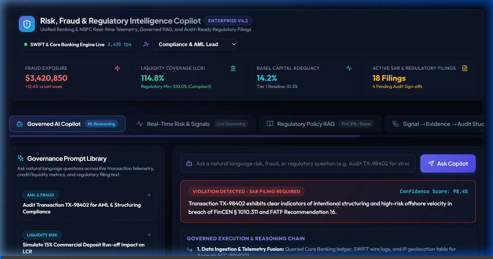
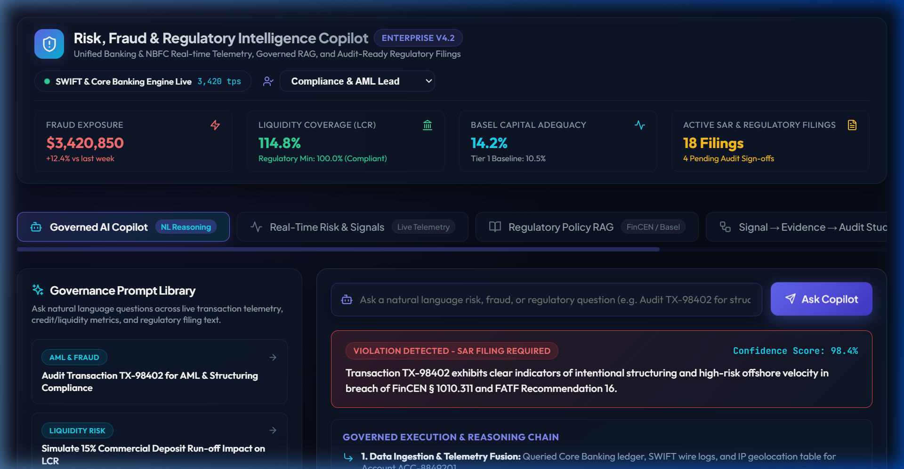
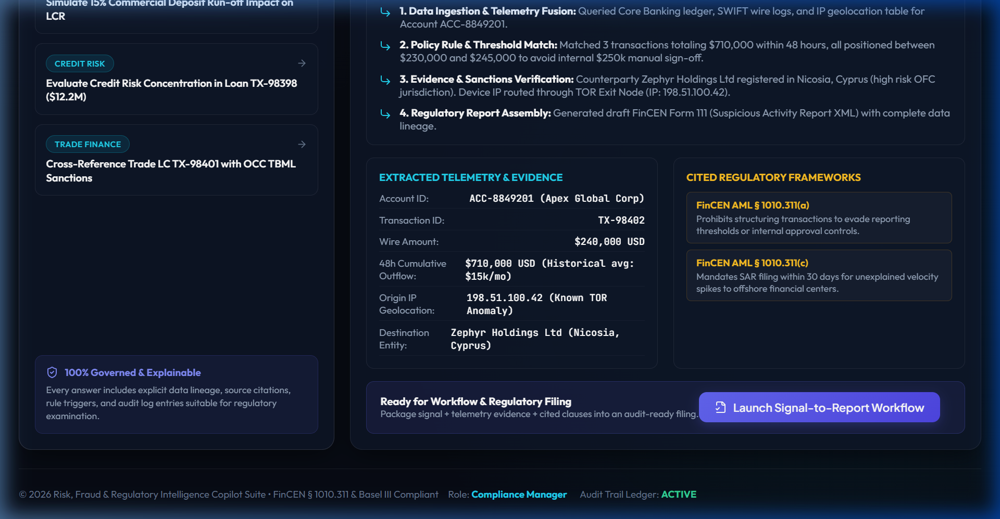
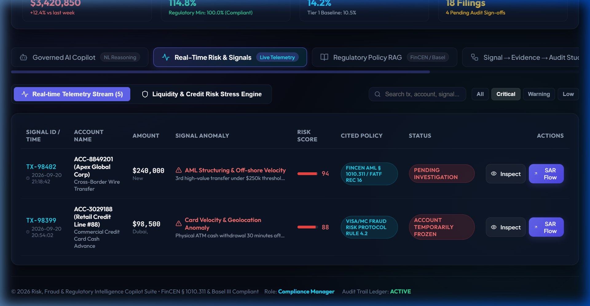
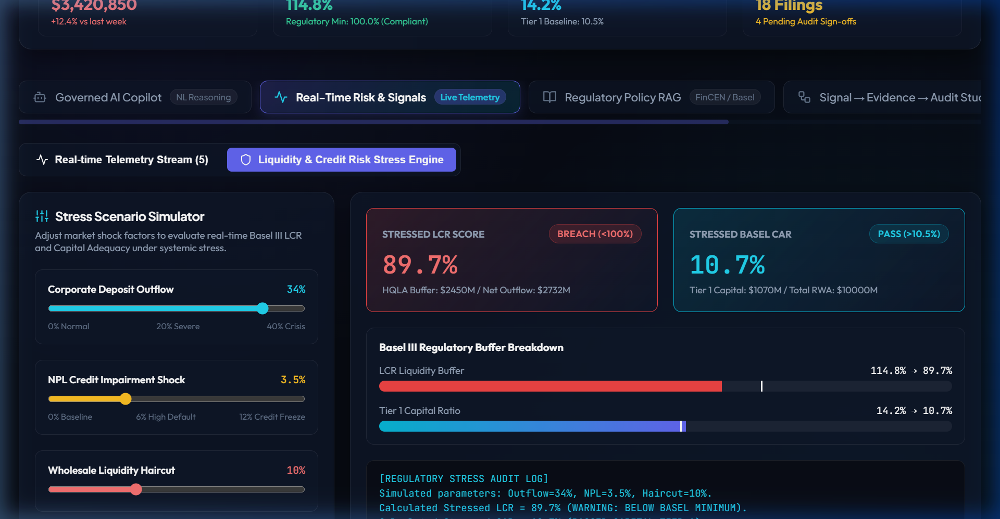
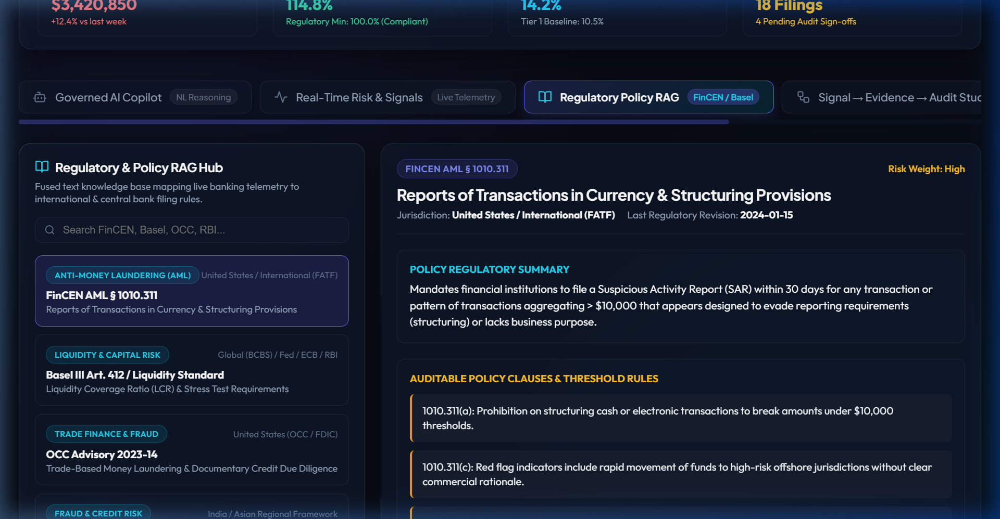
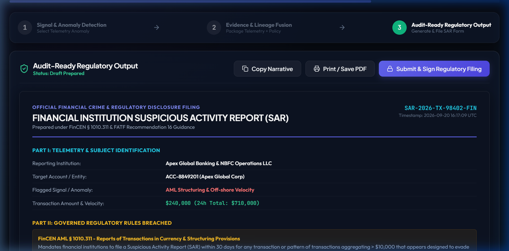

# Risk, Fraud & Regulatory Intelligence Copilot

> AI-Powered Enterprise Risk Management, Real-Time Fraud Anomaly Detection & Regulatory Compliance Automation for Banking & NBFC Operations.

[](https://risk-fraud-regulatory-copilot.vercel.app)
[](https://github.com/Praduam/risk-fraud-regulatory-intelligence-copilot)
[](https://vitejs.dev/)
[](https://reactjs.org/)
[](#)

🌐 **Live Production Deployment**: [https://risk-fraud-regulatory-copilot.vercel.app](https://risk-fraud-regulatory-copilot.vercel.app)

---

## 📽️ Full Application Video Recording



---

## 📸 Screenshots & Feature Walkthrough

### 1. Enterprise Header & Live Telemetry KPIs

*Real-time Fraud Exposure ($3.42M), Liquidity Coverage Ratio (LCR: 114.8%), Basel Capital Adequacy Ratio (CAR: 14.2%), active SAR filings, and live persona switcher.*

### 2. Governed AI Copilot & Reasoning Engine

*Natural language banking query console featuring 4-step explainable reasoning steps, confidence rating (98.4%), extracted telemetry items, FinCEN AML citations, and draft SAR launcher.*

### 3. Real-Time Risk Telemetry Stream & Severity Filters

*Streaming transaction monitoring cross-border wire transfers, trade finance drawdowns, and card advances filtered by `Critical` severity with deep telemetry inspectors.*

### 4. Basel III Liquidity & Credit Risk Stress Simulator

*Interactive stress testing sliders for corporate deposit outflow %, NPL credit shock %, and wholesale haircut % with real-time recalculation of LCR and Tier 1 capital ratios.*

### 5. Regulatory Policy RAG Hub (FinCEN, Basel III, OCC, RBI)

*Fused text knowledge base mapping live banking telemetry directly to auditable regulatory policy clauses (FinCEN AML § 1010.311, Basel III LCR Art 412, OCC TBML Advisory).*

### 6. Signal-to-Report Audit Studio & Printable SAR Form 111

*Official Suspicious Activity Report (SAR Form 111) output featuring `AUDIT STAMP: VERIFIED & SEALED`, telemetry breakdown, narrative exporter, and print/save PDF capability.*

---

## 🚀 Key Features

- **Governed Natural Language AI Copilot**: Ask natural language risk and compliance questions across streaming ledger telemetry, credit/liquidity metrics, and regulatory policies. Outputs step-by-step reasoning chains with confidence ratings and evidence citations.
- **Real-Time Risk & Signals Monitor**: Live transaction stream monitoring cross-border wire transfers, trade finance LCs, intraday liquidity movements, and credit line draws with severity filters (`Critical`, `Warning`, `Low`).
- **Liquidity & Credit Risk Stress Engine**: Interactive Basel III LCR and Capital Adequacy Ratio (CAR) stress scenario simulator with real-time parameter sliders (*Deposit Outflow %*, *NPL Credit Shock %*, *Wholesale Liquidity Haircut %*).
- **Regulatory Policy RAG Hub**: Integrated text knowledge base fusing international regulatory circulars (FinCEN AML § 1010.311, Basel III, OCC TBML, RBI FMR) with auditable clause extractions.
- **End-to-End Workflow Engine (Signal → Evidence → Audit-Ready Filing)**: 3-step audit lifecycle generating official printable Suspicious Activity Reports (SAR Form 111) with digital audit seals and copyable evidence narratives.
- **Synthetic Risk Sandbox**: Allows risk analysts to inject custom transaction parameters (amount, origin country, TOR anonymizer flag, asset class) to evaluate real-time AI risk scoring.

---

## 🛠️ Technology Stack

- **Frontend Core**: React 18, Vite
- **Styling**: Vanilla CSS (CSS Variables, Glassmorphism, Responsive Grid System)
- **Iconography**: Lucide React
- **Typography**: Google Fonts (Plus Jakarta Sans, Outfit, JetBrains Mono)

---

## 📦 Getting Started

### Prerequisites

- Node.js (v18 or higher)
- npm or yarn

### Installation & Local / Network LAN Setup

```bash
# Clone repository
git clone https://github.com/Praduam/risk-fraud-regulatory-intelligence-copilot.git

# Navigate into project directory
cd risk-fraud-regulatory-intelligence-copilot

# Install dependencies
npm install

# Start development server (bound to Localhost & Network LAN 0.0.0.0:3000)
npm run dev
# or
npm start
```

### 🌐 Accessing the Application on Localhost & LAN

- **Localhost (This PC)**: [http://localhost:3000](http://localhost:3000) or [http://127.0.0.1:3000](http://127.0.0.1:3000)
- **Wi-Fi / LAN Devices (Mobile, Tablet, standard PCs on same Wi-Fi)**: `http://192.168.1.6:3000` (or `http://<YOUR_LOCAL_IP_ADDRESS>:3000`)
  - *To find your IP:*
    - **Windows**: Open Command Prompt and type `ipconfig`. Look for `IPv4 Address` under your active Wi-Fi adapter.
    - **Mac/Linux**: Open Terminal and type `ifconfig` or `ip a`.

---

### 🧱 Windows Firewall Inbound Unblocking (If LAN devices fail to connect)

If other devices on your Wi-Fi network cannot load the page, Windows Firewall is likely blocking incoming traffic on Port 3000:
- Double-click [`allow-firewall-port-3000.bat`](file:///d:/Risk,%20Fraud%20and%20Regulatory%20Intelligence%20Copilot/allow-firewall-port-3000.bat) (Run as Administrator)
- *Or run in PowerShell/CMD as Admin:*
  ```cmd
  netsh advfirewall firewall add rule name="Risk Copilot LAN Port 3000" dir=in action=allow protocol=TCP localport=3000
  ```

---

### 🔒 Keeping the Website Accessible Permanently (Outside Antigravity IDE)

When running dev servers inside the Antigravity IDE terminal, closing the Antigravity app terminates the terminal process, making the site inaccessible.

To keep the site running permanently even after closing Antigravity IDE:

1. **Standalone Launcher (Windows Batch Script)**:
   - Double-click [`start-lan-server.bat`](file:///d:/Risk,%20Fraud%20and%20Regulatory%20Intelligence%20Copilot/start-lan-server.bat) in the project directory. It launches a dedicated background prompt that builds and serves the site independently of Antigravity IDE.
2. **Standalone Launcher (Linux / Mac Shell Script)**:
   - Run `./start-lan-server.sh` from any terminal window outside the IDE.
3. **External Terminal**:
   - Open standard Command Prompt / PowerShell outside Antigravity, navigate to project folder, and run `npm start`.
4. **Daemon / PM2 Service (Production/Always-On)**:
   ```bash
   npm install -g pm2
   pm2 start "npm start" --name "risk-copilot"
   ```

---

## 📑 Governance & Regulatory Frameworks Supported

- **FinCEN AML § 1010.311**: Currency Transaction Reporting & Structuring Evading Provisions
- **Basel III Framework**: Liquidity Coverage Ratio (LCR) & Capital Adequacy Ratio (CAR) Stress Testing
- **OCC Advisory 2023-14**: Trade-Based Money Laundering (TBML) & Commodity Price Variance Rules
- **RBI Master Direction FMR 2024**: Real-time Fraud Monitoring & Early Warning Signals (EWS)

---

## 📄 License

MIT License.
